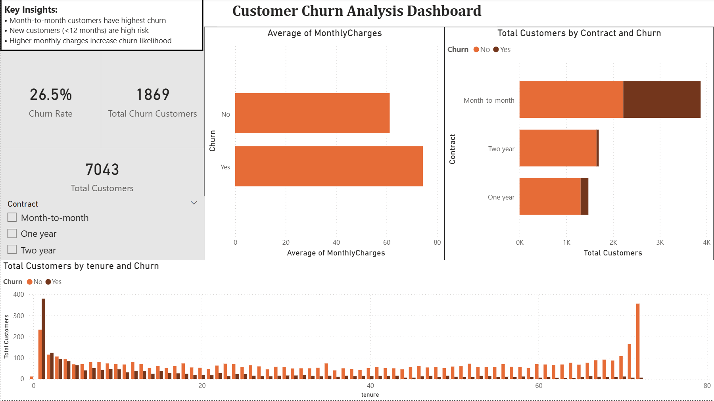

# Customer Churn Analysis

## 📊 Project Overview
This project analyzes customer churn behavior using Python, SQL, and Power BI. The objective is to identify key factors contributing to customer churn and provide actionable insights to improve customer retention.

---

## 🎯 Objectives
- Understand customer churn patterns  
- Identify high-risk customer segments  
- Analyze the impact of contract type, tenure, and pricing  
- Provide data-driven business recommendations  

---

## 🛠️ Tools Used
- **Python (Pandas, NumPy)** – Data cleaning and analysis  
- **MySQL** – Data querying and aggregation  
- **Power BI** – Data visualization and dashboard creation  

---

## 📁 Project Structure

customer-churn-analysis/
│
├── data/
├── notebooks/
├── dashboard/
├── images/
└── README.md

---

## 📊 Dashboard Preview


---

## 📌 Key Insights
- Approximately **26.5% of customers have churned**  
- Customers on **month-to-month contracts** show the highest churn  
- **New customers (<12 months tenure)** are more likely to churn  
- Higher monthly charges are associated with increased churn  

---

## 💡 Business Recommendations
- Encourage long-term contracts through incentives  
- Improve onboarding experience for new customers  
- Offer retention strategies for high-paying customers  

---

## 🧠 Analytical Approach
1. Data Cleaning (handling missing values, fixing data types)  
2. Exploratory Data Analysis (EDA)  
3. Customer segmentation using NumPy  
4. SQL queries to validate insights  
5. Dashboard creation for visualization  

---

## 📈 Sample SQL Query

```sql
SELECT Churn, COUNT(*) 
FROM customers
GROUP BY Churn;

```
## 🚀 Outcome

This project demonstrates an end-to-end data analysis workflow, combining Python, SQL, and Power BI to generate meaningful business insights.
